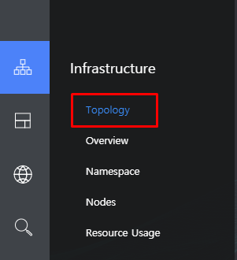
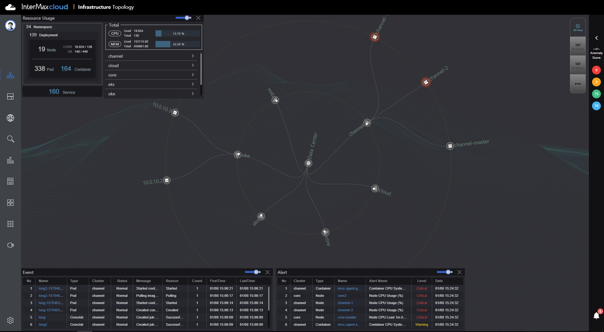
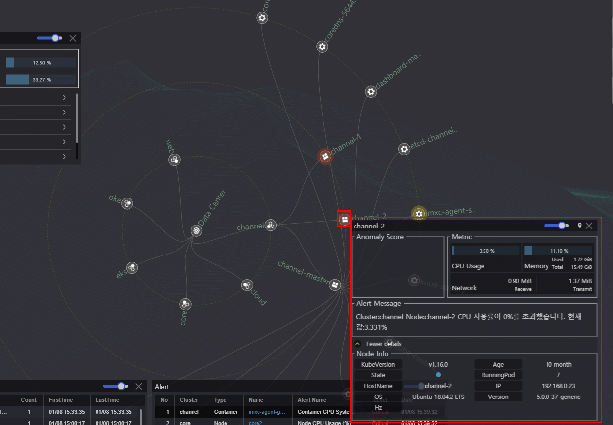
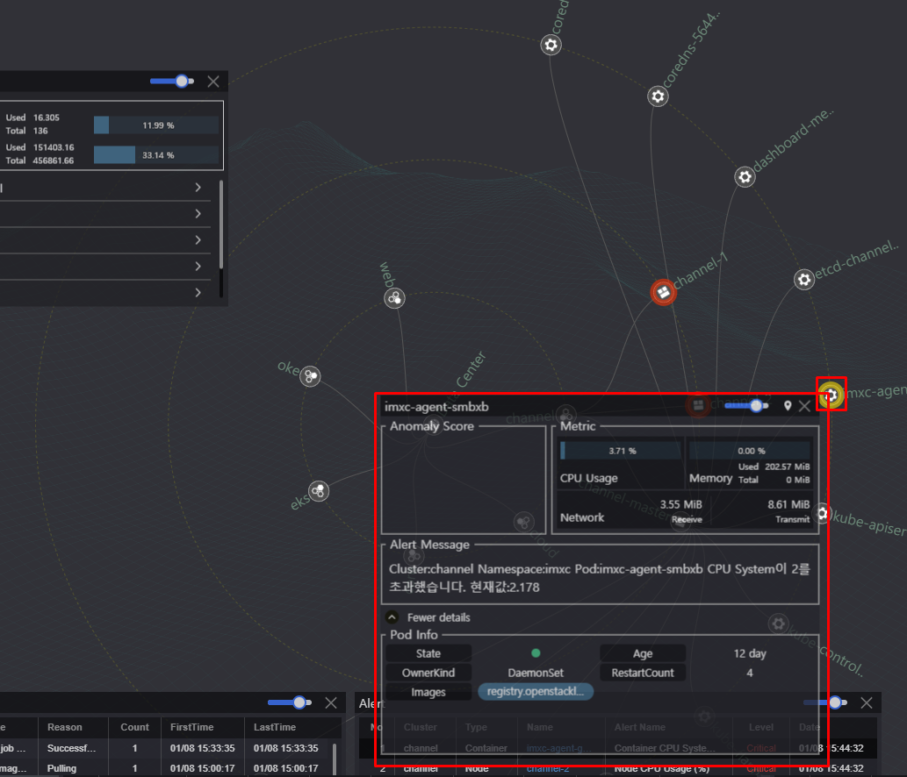
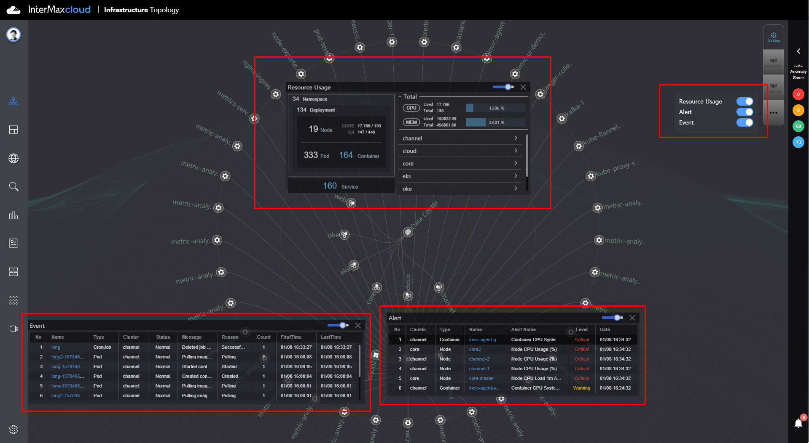

=== Infrastructure
Kubernetes로 구성 된 환경을 한번에 보거나 특정 Cluster / Namespace로 필터를 통해
Node에 대한 매트릭 지표 및 사용량을 실시간으로 볼 수 있는 화면을 제공한다.

==== Topology
[%hardbreaks]
Kubernetes로 구성 환경 전체를 볼 수 있다.
Cluster --> Node --> Pod --> Container

===== 2D Topology
- 2DTopology는 DataCenter를 중심으로 cluster로 연결이 되어 있으며
해당 cluster를 클릭하면 해당 Node가 펼쳐지고 Node를 클릭하면 Node와 연결되어 있는 Pod가 펼쳐지고 Pod를
클릭하면 container들이 나오게 된다.

- Node & Pod에 마우스 오른쪽을 클릭 하게 되면 아래 이미지와 같이 ToolTip이 나오고 Info 정보가 표출이 된다.
또 alert이 발생하게 되면 원 주변에 빨간색 / 주황색 알람이 반짝반짝 표시가 된다.

TIP: toolTip에 Metric을 클릭하게되면 해당 상세 화면으로 페이지가 이동 된다.

- Topology 화면에서는 3가지 팝업창이 제공된다 .

.Resource Usage
* Summary 정보를 제공 해준다.
* 각 cluster 별 CPU / Memory를 볼 수 있다.

.Event
* Kubernetes에서 발생한 Event Message를 리스트로 제공한다.
* Name을 클릭하게 되면 해당 type 화면으로 페이지가 이동된다.

.Alert
* Setting에서 설정한 알람리스트를 제공한다.
* Name을 클릭하게 되면 해당 type 화면으로 페이지가 이동된다.

TIP: 우측에 팝업창을 켜고 끌수 있는 토글이 있다.

==== Overview

==== Namespace

==== Nodes

==== Resource Usage
